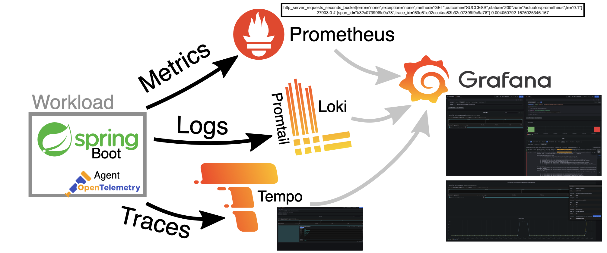
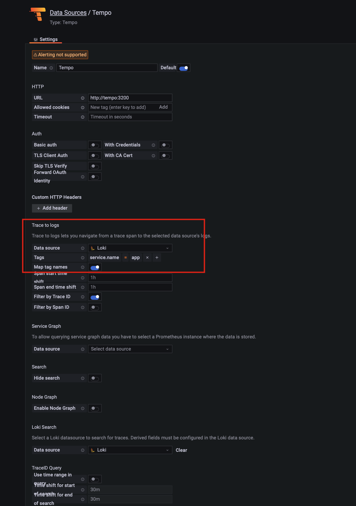

# Spring Web Application using Kotlin

This repository contains an example project using Spring Boot 3 mvc  modeling  logging + tracing + metrics
solution using Grafana single source of truth to be able to track any problem in our system.

* Grafana Loki : Ingesting logs of your application using logback appender (logback-spring.mxl)

* Grafana Tempo: tracing storage tool (from grafana team)

* Prometheus: Prometheus is one of the best time series database and is considered best solution to store your app's metrics.

* Exemplejar: references to data outside of the MetricSet. A common use case are IDs of program traces.
**  Example metrics using trace_id:

    foo_bucket{le="1"} 11 # {trace_id="KOO5S4vxi0o"} 0.67

** Example Spring boot metric ():

    http_server_requests_seconds_bucket{error="none",exception="none",method="GET",outcome="SUCCESS",status="200"zuri="/actuator/prometheus",le="0.1"} 27903.0 # {span_id="b32c07399f9c9a78",trace_id="63e61e02ccc4ea83b32c07399f9c9a78"} 0.004050792 1676025346.167

# Infraestructure: docker compose

Docker compose file exits in the project to make easier run all containers needed in the infrastructure. Let me show you main configuration

- Grafana tempo: docker container Grafana Tempo. It must configure Zipkin as main receiver to be able to store tracing info in its storage.

- Grafana loki: docker container Grafana Loki. It will store logging info received from logback-spring appender defined in applitacion (logback-spring.xml)

- Prometheus: docker container Prometheus. It will store all application's metrics provided by Spring boot actuator endpoint (exemplejar included)

- Grafana: docker container Grafana. It will show all metrics/logging/tracing info inside a main dashboard called Logs, Traces, Metrics

# How it works

Metrics, logging and tracing must use trace_id to be able to navigate from one source to another
making easy to evaluate the cause of on exception in our system.

## Metrics

### Spring boot metrics

Spring boot metrics provides a metrics endpoint that can be used diagnostically to examine the metrics collected by an application. You can receive metrics of your application, it is possible to correlate this information with a trace_id sending percentiles-histogram information Out of the box ( must be enable in application.properties)

   management.metrics.distribution.percentiles-histogram.http.server.requests= true

Now when we create and http call to Prometheus endpoint (http://localhost:8081/actuator/prometheus)
using accept header with value "application/openmetrics-text; version=1.0.0; charset=utf-8" percentiles info is attached with trace_id and span_id info:

image::images/prometheus_trace_id.png[]

### Prometheus

Prometheus database will scrape actuator info and store it in database using Exemplejar info (trace_id and span_id): docker/prometheus/prometheus.yml

## Logging

Grafana loki will store all application's logs. We define logback-spring.xml (main/resources) using loki appender.It is very important to define tags to be added per log line. These labels will be used
 later to be able to correlate log/tracing (traceID label is a must)

      <pattern>app=${appName},host=${HOSTNAME},traceID=%X{traceId:-NONE},level=%level, class=%C </pattern>

Loki label generated

## Tracing

Grafana Tempo will store all Tracing info (traceID is attached out of the box)

# Grafana Configuration in detail

Let's have a look main configuration used in Grafana to be able to connect trace_id between layers

- Prometheus: It defines how to use exemplejars to be able to navigate from metrics to tracing

- Tempo: it defines  loki query to navigate from trace to log

It needs to correlate service.name (tracing label) --> app (log label defined in logback pattern)

image::images/tracing-logging.png[]

- Loki: It defines defered field to navigate from log to trace

# How to run the example

* Run docker container inside main directory

   docker-compose up

* Run Spring boot application

* Test your metrics creating serveral http calls to
** http://localhost:8081/message/ok
** http://localhost:8081/message/ko
** http://localhost:8081/message/exception

* Open Grafana and go to the main panel (Logs, Traces, Metrics) http://localhost:3000:

image::images/grafana-main2.png[]

# Spring boot 3.0: new Observality approach

What is observability? In our understanding, it is "how well you can understand the internals of your system by examining its outputs". We believe that the interconnection between metrics, logging, and distributed tracing gives you the ability to reason about the state of your system in order to debug exceptions and latency in your applications. You can watch more about what we think observability is in this episode of Enlightning with Jonatan Ivanov.

To add observation features to your application, spring-boot-starter-actuator is a must (to add Micrometer to the classpath).

* Metrics

For Micrometer metrics with Prometheus, we need to add the io.micrometer:micrometer-registry-prometheus dependency.

* Tracing

For Tracing Context Propagation with Micrometer Tracing, we need to pick a tracer bridge (tracer is a library that is used to handle the lifecycle of a span). We pick Zipkin Brave by adding the io.micrometer:micrometer-tracing-bridge-brave.

The client application that we will create for this demo will use another tracer library to show an interop between tracers.
For Latency Visualization, we need to send the finished spans in some format to a server. In our case, we produce an Zipkin-compliant span. To achieve that, we need to add the io.zipkin.reporter2:zipkin-reporter-brave dependency.

* Logs

Since we have Micrometer Tracing on the classpath, the logs are automatically correlated (that is, they contain a unique trace identifier). Now we need to ship the logs. For this demo, we ship them to Grafana Loki. We can achieve that by adding the com.github.loki4j:loki-logback-appender dependency

